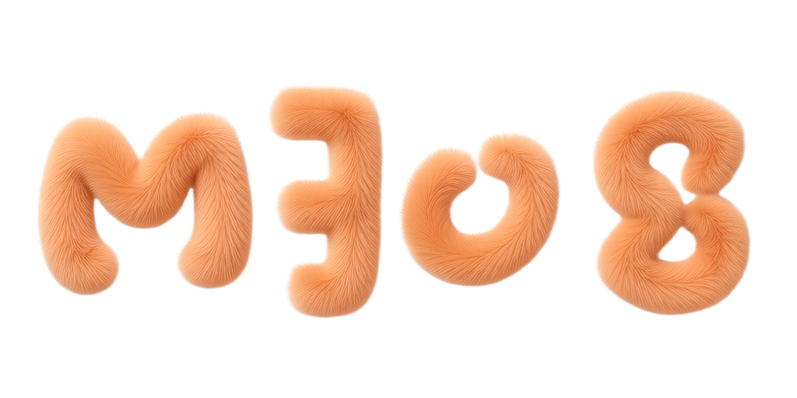

<div align="center">
  

<big><big><big><strong>meow-loader</strong></big></big></big><br />
<small><i>m3u8 loader</i></small>
<br /><br />
</div>


Download M3U8/HLS video. Output to MP4.

```bash
npx meow-loader <m3u8-url>
```

## Features

- Parse M3U8 playlists (both master and media)
- Auto-detect and select highest quality variant
- Interactive variant selection for master playlists
- AES-128 encrypted HLS support
- Sequential segment download with progress indicator
- Merge segments into single MP4 via ffmpeg

## Requirements

- [Node.js](https://nodejs.org/) 18+
- [ffmpeg](https://ffmpeg.org/) (for MP4 merging)


### Examples

```bash
# Download with default output (output.mp4)
npx meow-loader https://example.com/stream.m3u8

# Specify output filename
npx meow-loader https://example.com/stream.m3u8 my-video.mp4

# Select a specific quality variant by index
npx meow-loader https://example.com/master.m3u8 my-video.mp4 1
```

### Interactive Mode

When a master playlist is detected and no variant index is provided, you'll be prompted to choose:

```
Master playlist detected. Available variants:
  [0] 5192 kbps (1920x1080)
  [1] 2928 kbps (1280x720)
  [2] 1528 kbps (960x540)
  [3] 896 kbps (640x360)
Select variant (0-3, default: 3 highest):
```

<br />
<br />


## Development

### Clone the Repository

```bash
git clone https://github.com/amoshydra/meow-loader.git
cd meow-loader
```

### Install Dependencies

```bash
pnpm install
```

### Build

```bash
pnpm run build
```

### Run

```bash
node dist/index.js <m3u8-url>
```

## License

MIT
